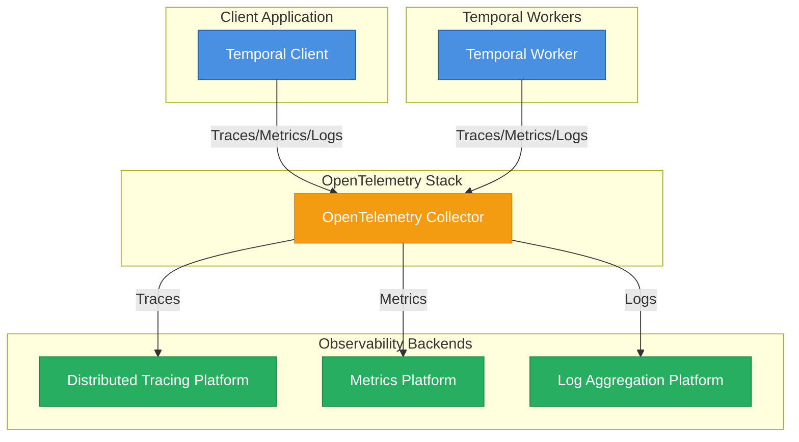

# Architecture of Temporal and OpenTelemetry Components

This document provides a comprehensive overview of the architecture of Temporal OpenTelemetry integration.

## System Architecture



This project consists of several key components working together to provide complete observability for Temporal Workflows.

1. **Temporal Client** - initiates workflows and emits telemetry for Temporal Workflow Starts events.
1. **Temporal Worker** - executes and emits telemetry for Workflow Tasks and Activities
1. **OpenTelemetry Collector** - receive, process, and export OpenTelemetry data
1. **Observability Backends** - store and analyze OpenTelemetry data

## Why OpenTelemetry Collector

The OpenTelemetry Collector serves as a crucial intermediary component that provides several key benefits:

### 1. **Decoupling and Reliability**

- **Service Independence**: Client and Worker applications don't need direct connections to multiple observability backends.
- **Resilience**: If a backend is temporarily unavailable, the collector can buffer and retry telemetry data.
- **Simplified Configuration**: Operators can control the telemetry configuration without modifying the application code.

### 2. **Data Processing and Enhancement**

- **Batch Processing**: Efficiently batches telemetry data before sending to backends, reducing network overhead.
- **Data Transformation**: Processors can modify, filter, or enrich telemetry data (e.g., `cumulativetodelta` for Dynatrace).
- **Sampling**: Can implement intelligent sampling strategies to manage data volume.
- **Attribute Addition**: Can add consistent tags/attributes across all telemetry data.

### 3. **Operational Benefits**

- **Centralized Management**: Centralize telemetry routing and processing rules.
- **Security**: Can handle authentication/authorization to backends centrally.
- **Standardization**: Enforces consistent telemetry formats across all applications.
- **Connection Pooling**: Maintains efficient connections to backends

## How OpenTelemetry integrates with Temporal Workflows

### Distributed Tracing

**Implementation**: Uses Temporal's built-in `TracingInterceptor` to automatically instrument workflow and activity executions.

```python
# python/worker.py
from temporalio.contrib.opentelemetry import TracingInterceptor

tracer = create_tracer()
client = await Client.connect(
    settings.TEMPORAL_HOST,
    interceptors=[TracingInterceptor(tracer=tracer)],
)
```

**Trace Setup**: Custom tracer creation with OTLP exporter (`python/common/trace.py`):

```python
# Creates BatchSpanProcessor with OTLPSpanExporter
processor = BatchSpanProcessor(
    OTLPSpanExporter(endpoint=settings.OTLP_ENDPOINT, insecure=True)
)
```

**Auto-instrumentation**: Third-party libraries are automatically instrumented:

```python
# python/common/trace.py
AioHttpClientInstrumentor().instrument()  # HTTP calls in activities
```

### Application Metrics

**Implementation**: Leverages Temporal's native OpenTelemetry metrics support through runtime configuration.

```python
# python/common/metrics.py
Runtime(
    telemetry=TelemetryConfig(
        metrics=OpenTelemetryConfig(
            url=settings.OTLP_ENDPOINT,
            http=False,  # Uses gRPC transport
        )
    )
)
```

**Metrics Exported**: Temporal automatically exports Workflow Task, Activity, and Worker metrics to the OpenTelemetry Collector.

### Structured Logging

**Implementation**: Custom logging handler that exports logs via OTLP protocol.

```python
# python/common/log.py
logger_provider = LoggerProvider(resource=Resource.create({"service.name": "temporal-python"}))
logger_provider.add_log_record_processor(
    SimpleLogRecordProcessor(OTLPLogExporter(endpoint=settings.OTLP_ENDPOINT))
)
```

**Usage**: Standard Python logging enhanced with OpenTelemetry context:

```python
# python/workflow.py
workflow.logger.info("Workflow: triggering HTTP GET activity to %s", url)
activity.logger.info("Activity: making HTTP GET call to %s", url)
```
